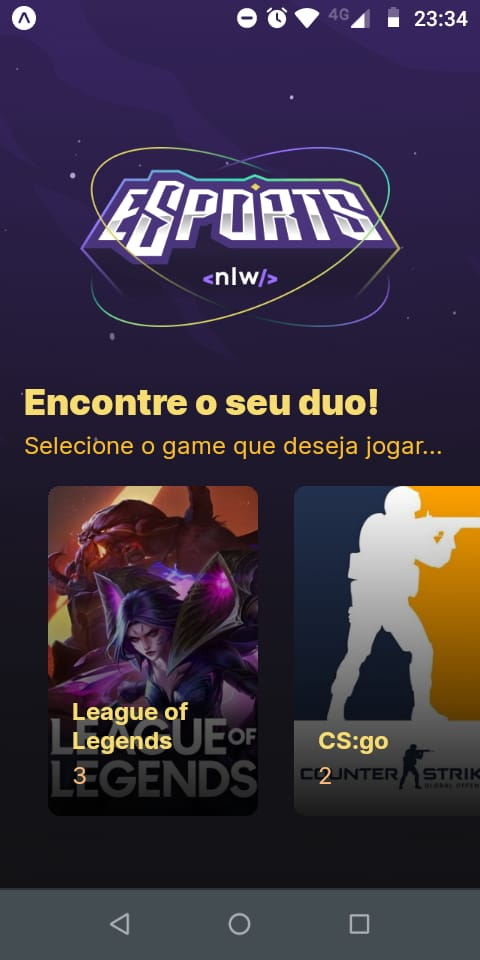
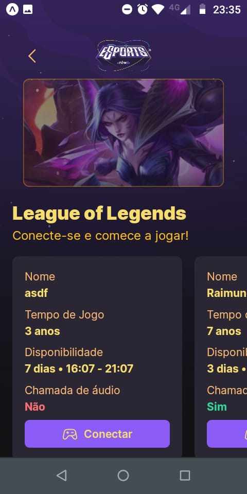
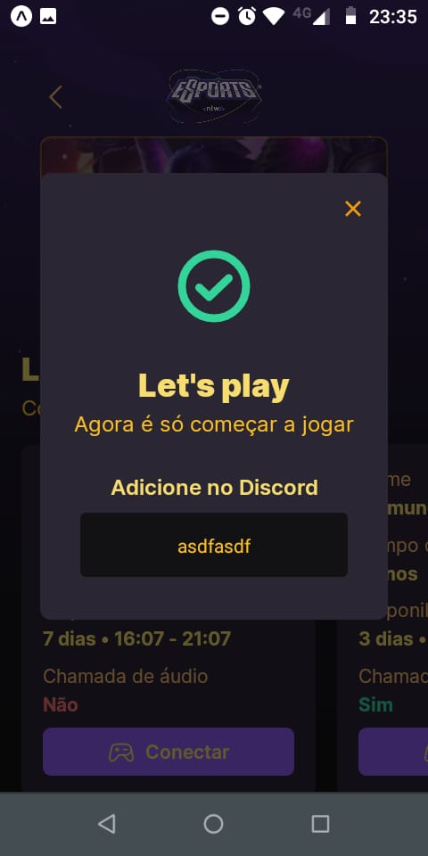
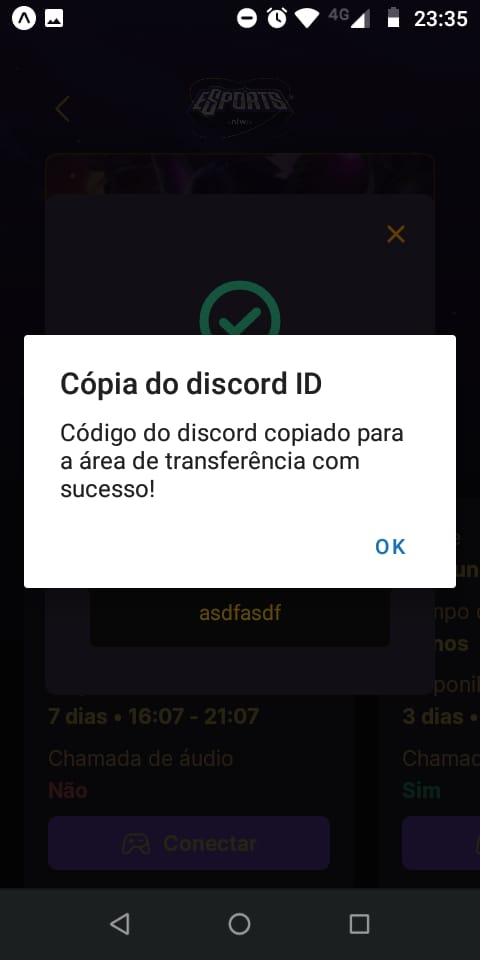

# nlw-esports-app

It is an App to consume a Rest API [nlw-esports-server](https://github.com/esbnet/nlw-esports-server). Its purpose is to locate players with advertisements for the games of interest to them.

## Pré-requisites

- node
- expo CLI (https://blog.expo.dev/new-versioned-expo-cli-cf6e10632656)
- server running ([how to isntall and run](https://github.com/esbnet/nlw-esports-server))

## Technologies:

- react
- axios
- tailwindcss
- typescript

## How it works:

1. Select the game: 
    

2. Select the advertisement and click on button "Conectar" 
    

3. In the info, click on the discord code to copy it to the clipboard and search for it on Discord 
    

4. Confirmation of copy to clipboard: 
    

## Installation

Clone this project into your project directory:

`git clone https://github.com/esbnet/nlw-esports-app.git`

## Start

Run the following command to start the aplication:

`expo start`

## End-Points:

The application consumes the following end-points:

- GET `/games'` - Get a list of games
- POST `/game/:id/ads` - Create a ad for the game by id
- GET `/games/:id/ads` - Get ad for the game by id
- GET `/ads/:id/discord` - Get ads for the game selected
